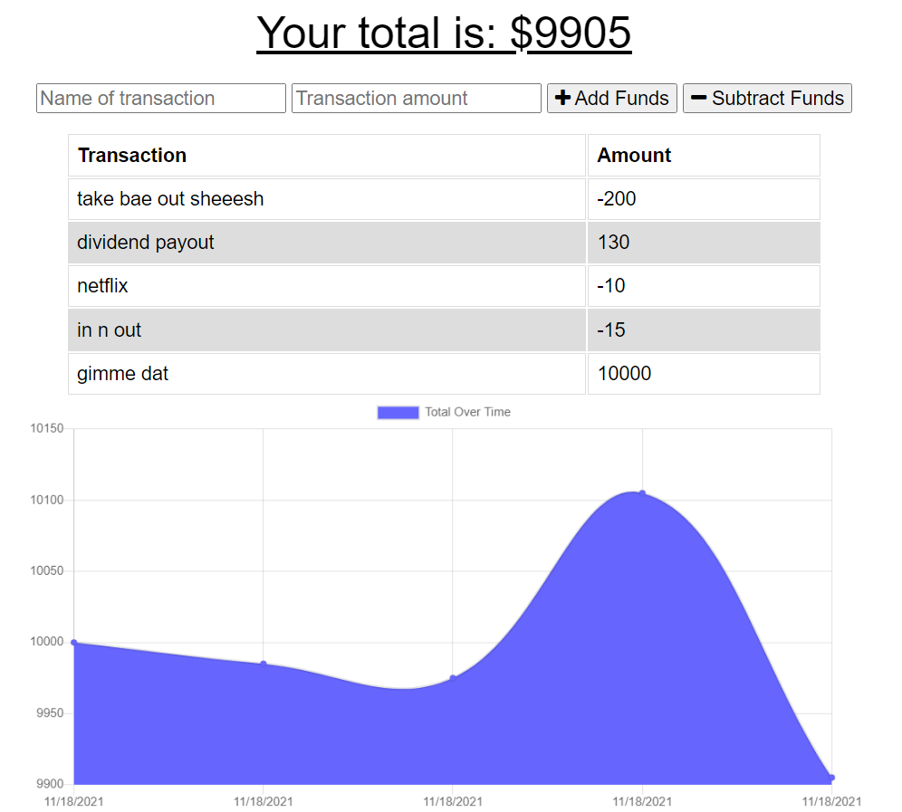

# Budget Tracker

[](https://opensource.org/licenses/MIT)

## Description 

This progressive web application lets you track your deposits and expenses - either online or offline. A user may install this app as a PWA by clicking the ```Install Budget Tracker``` icon in the address bar of your browser. It utilizes IndexedDB to store transactions offline and updates your records once the app detects an internet connection. Using webpack allows for different parts of the code to be bundled together which results in fewer dependencies.

Try it out at: [Heroku](https://safe-mountain-42147.herokuapp.com/)

## Preview


## Table of Contents

* [Techonologies Used](#technologies-used)
* [Usage](#usage)
* [Code Snippet](#code-snippet)
* [Questions](#questions)
* [Author Links](#author-links)

## Technologies Used

- JavaScript - programming language used for this app
- Node.js - runtime environment
- Express.js - back end web application framework
- MongoDB - non-relational database management system
- MongoDB Atlas - cloud database
- Mongoose - ODM
- Morgan - HTTP request logger middleware
- Webpack - module bundler
- Webpack PWA Manifest - webpack plugin that generates a manifest.json for PWAs
- Git - version control
- Github - where the repository is hosted
- Heroku - where the project is deployed

## Usage

Click [here](https://safe-mountain-42147.herokuapp.com/) to start managing your budget.

## Code Snippet

webpack config file that bundles files and generates a manifest
```
const WebpackPwaManifest = require("webpack-pwa-manifest");
const path = require("path");

const config = {
    entry: {
        db: './public/db.js',
        index: './public/index.js'
    },
    output: {
        path: __dirname + '/public/dist',
        filename: '[name].bundle.js',
        publicPath: '' //removes auto from icons in manifest.json
    },
    mode: 'production',
    module: {
        rules: [
            {
                test: /\.js$/,
                exclude: /node_modules/,
                use: {
                    loader: 'babel-loader',
                    options: {
                        presets: ['@babel/preset-env']
                    }
                }
            }
        ]
    },
    plugins: [
        new WebpackPwaManifest({
            filename: 'manifest.json',
            inject: false,
            fingerprints: false,
            name: 'Budget Tracker',
            short_name: 'Budget',
            description: 'An app that helps you track deposits and expenses',
            background_color: '#ffffff',
            theme_color: '#ffffff',
            start_url: '/',
            display: 'standalone',
            icons: [
                {
                    src: path.resolve(__dirname, "public/icons/icon-512x512.png"),
                    sizes: [192, 512]
                }
            ]
            
        })
    ]
}

module.exports = config;
```

## License

This application is covered under the MIT license.

## Questions

Have any questions? My Github and email:

[My Github Link](https://github.com/mushymane)  
Email: mushymanee@gmail.com

## Author Links
[LinkedIn](https://www.linkedin.com/in/luigilantin/)